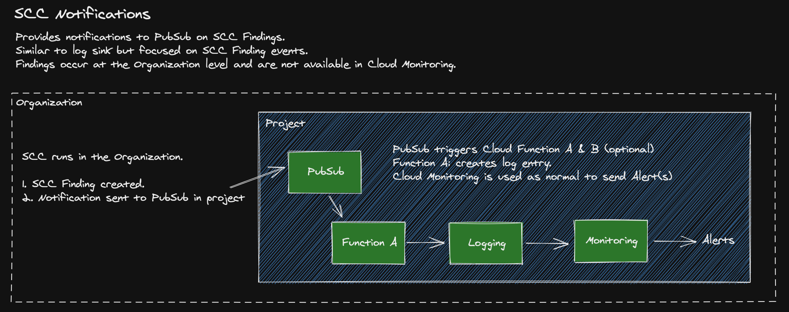

<h1 align="center">

<br>SCC Notifications to Alerts
</h1>
<h5 align="center">Setup Alerts for Google Cloud Security Command Center Findings</h5>
<p align="center">
  <a href="#features">Features</a> •
  <a href="#requirements">Requirements</a> • 
  <a href="#installation">Installation</a> •
  <a href="#cleanup">Cleanup</a>
</p>
## Features

This Security Command Center (SCC) Alerts project extends the default behavior of SCC Findings to add the ability to setup Alerts using Cloud Monitoring.

A shortcoming of SCC is the lack of metrics and alerting via Cloud Monitoring since Findings are only visible at the Organization Level. By [exporting findings into PubSub](https://cloud.google.com/security-command-center/docs/how-to-notifications) [1], along with this project’s scripts, you can make notifications available in Cloud Monitoring. With this project’s scripts, you can

- Automate the setup and removal of SCC Notifications to PubSub into your project
- Log the Findings into your project, making the data available to Cloud Logging & Cloud Monitoring
- Remove or reduce any custom scripts to be created and use standard GCP features where available



## Requirements

To run the scripts you will need the following.

- **Organization ID**
- **Project ID** - where the resources will be installed
- **Service Account** - a service account for SCC Notifications to run
- Security Command Center API must be enabled
- You will need IAM security roles of 
  - Security Center Admin - to setup notifications
  - Organization Admin - to setup the service account with needed roles

## Installation

### Clone the repository 

[](https://ssh.cloud.google.com/cloudshell/editor?cloudshell_git_repo=https%3A%2F%2Fgithub.com%2Fgschaeffer%2Fscc_alerts&cloudshell_git_branch=main)

Clone the repo to Cloud Shell. Optionally, clone to a VM or your local machine if you prefer.
```bash
git clone https://github.com/gschaeffer/scc_notifications
```

#### Edit variables

Edit the script variables in the setup.sh file. You must edit the organization id, project id, and service account values. The remaining variables are optional.

```bash
ORG="YOUR_GCP_ORGANIZATION_ID
PROJECT_ID="YOUR_PROJECT_ID"
SA_ACCOUNT="YOUR_SERVICE_ACCOUNT"
```

#### Run setup

First, we install the SCC Notifications to PubSub as described by Google [1 above].  Use the setup.sh command which automates this process.

```bash
./setup.sh apply
```

This creates only the resources as described in the SCC Notifications doc [1]. At this point you should begin seeing notifications being sent to the PubSub topic as they are identified in SCC.

#### Add a Cloud Function

Second, to make Findings events available in Cloud Monitoring, install the provided Cloud Function. This will begin sending Findings from PubSub to Cloud Logging & Cloud Monitoring.

```bash
./functions/deploy_logger_func.sh
```

This will install a very simple Python function that will be triggered by Findings being added to the PubSub Topic. After installing you should begin seeing log entries in Cloud Logging. These entries are logged into a log named *scc_notifications_log* for easy search. 

With the Findings in Cloud Logging all the normal tools are available to setup Metrics and Alerts, https://cloud.google.com/monitoring/alerts. 

#### Cleanup

To remove the resources installed use the same setup command with `delete` argument and `gcloud` to remove the cloud function. Change the function name and region variables as needed.

```bash
./setup.sh delete

FUNCTION="scc_notification_handler"
REGION="us-central1"

gcloud functions delete $FUNCTION --region $REGION
```
